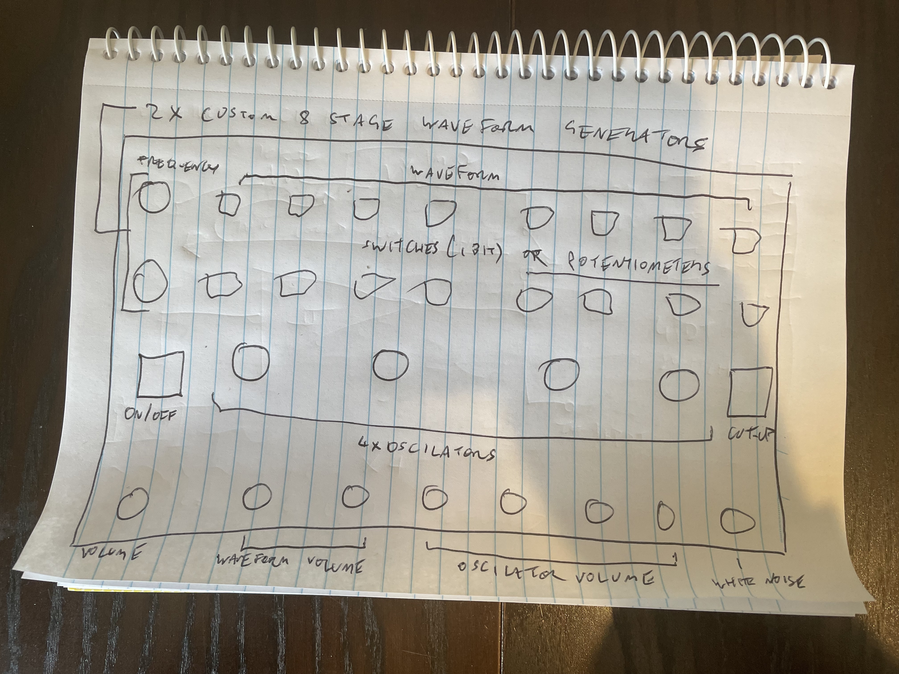

# KAOS ENGINE

based on:

* 40106 hex inverting schmitt trigger
* 4040 binary counter/divider
* 4051 8 channel analog multiplexer/demultiplexer  

- the 40106 provides control oscilators for the 4040. the 4051 generates custom waveforms with the 4040 as its controller
- ~~the other 4 oscilators on the 40106 are audio LFOs~~
- ~~2 2N3904s doing the loose connection electron cascade thing(?) to produce white noise~~

_see below_

~~everything is summed together with individual volume controls and a master volume control.~~  

~~I will need to breadboard prototype this because it's already complicated and will probably get more complicated.~~



## ~~**PROVISIONAL DESIGN**~~  

### ~~**TO CONSIDER:**~~
- [ ] ~~how many cut-up buttons and where? (everything? each type of everything?)~~
- [ ] ~~mixing: volume for everything vs. combining some volume controls~~
- [ ] ~~voltage starving JUST FOR THE HEX INVERTER~~
- [ ] ~~should the custom waveforms have: switches? dials? **both?**~~

### ~~see [circuit](circuit) for design.~~  

~~_need to figure out how many cut-up switches to use and where_~~  

~~_possibly add a LM741 amplifier and a distortion circuit_~~  

---

**okay screw all of that. not redrawing the circuit yet until i can prototype it but i'm now thinking... two(?) waveform generators with switches AND dials, frequency for each 4040 from a hex inverter. starvation on the hex inverter, two power fuckers, two schmitt triggers unused. two volumes on each waveform, master volume, on/off, audio on/off, momentary audio cutoff. on/off and cutoff for each waveform. audio pulse on for all of it (i.e. the opposite of a cutoff, xandra suggested one button that changes function if the main switch is on or off but i think that would need an IC so two buttons is probably easier and cleaner sound-wise). OPTIONAL large cap on the power line (like the HEXARCH but you can turn it off entirely). on/off for each power fucker.**  

so that is:

* 2 frequency dials
* 8x waveform dials + 8x waveform switches x2 (16 for each waveform 32 in total)
* 2 waveform volume controls + master volume
* 2 power fucker dials + 1 power fuckers on/off switch
* audio on/off, audio cutoff, audio pulse on
* 2x waveform on/off (maybe a three-way switch: WAVE1-BOTH-WAVE2?)
* 2x cutoff for waveform
* 2x pulse on for waveform (maybe would only need one button)
* starvation for hex inverter

which is a total of... over 40 things.  

_might need to rethink this..._

### MAYBE

***18 easy spaces in the same casing as the HEXARCH***

* 2x frequency (2x 40106) (2) 
* 8x dual gang pots **OR** 8x DPDT switches for waveforms (10)
* 2x POWER FUCKER (2x 40106) (12)
* VOLUME (13)
* **STEREO OUT** fader (14)
* **STEREO OUT** DP3T ON-ON-ON (1, both, 2) SWITCH (15)
* **STEREO OUT** CUT-OFF MOMENTARY (L/R) (17)
* voltage starve for 401016 (18)

```
VOL---STRV--PWR1--PWR2--FREQ1-FREQ2
 |     |     |     |     |     |
FADE--DP3T--DPDT1-DPDT2-DPDT3-DPDT4
 |     |     |     |     |     |
CUT1--CUT2--DPDT5-DPDT6-DPDT7-DPDT8
```
